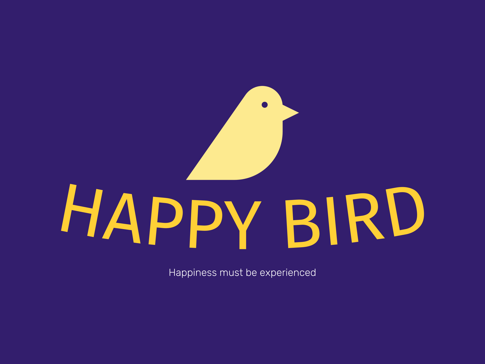

<a name="readme-top"></a>

<!-- PROJECT SHIELDS -->

<center>

[![Forks][forks-shield]][forks-url]
[![Stargazers][stars-shield]][stars-url]
[![Issues][issues-shield]][issues-url]
[![LinkedIn][linkedin-shield]][linkedin-url]

</center>

<!-- PROJECT LOGO -->
<br />
<div align="center">
  <a href="https://github.com/othneildrew/Best-README-Template">
    
  </a>

  <h3 align="center">Happy Bird</h3>

  <p align="center">
    3D Version of the famous game about flying birds and dodging pillars
    <br />
    <a href="https://happy-bird.vercel.app/"><strong>Explore the game »</strong></a>
    <br />
    <br />
    <a href="https://github.com/othneildrew/Best-README-Template/issues">Report Bug</a>
    ·
    <a href="https://github.com/othneildrew/Best-README-Template/issues">Request Feature</a>
  </p>
</div>

<!-- ABOUT THE PROJECT -->

## About The Project

![Happy Bird Main Menu][product-screenshot]

Happy Bird is the 3d version of the famous flappy bird with little tweaks here and there to make it feel fun and immersive in the urban setting.

<p align="right">(<a href="#readme-top">back to top</a>)</p>

### Built With

This project is built with:

-   Three.JS
-   Javascript
-   HTML5
-   CSS3

<p align="right">(<a href="#readme-top">back to top</a>)</p>

<!-- GETTING STARTED -->

## Getting Started

Visit the live demo: https://happy-bird.vercel.app/

Follow the below steps to reproduce the code base locally.

### Prerequisites

Make sure you have npm installed

-   npm
    ```sh
    npm install npm@latest -g
    ```

### Installation

To run in development mode, type the following command

-   npm
    ```sh
    npm run dev
    ```

<p align="right">(<a href="#readme-top">back to top</a>)</p>

<!-- USAGE EXAMPLES -->

## Usage

The controls for the app:

-   Press space to jump or to restart upon collision
-   Press r to restart upon collision
-   Left click to jump
-   Touch to jump

<p align="right">(<a href="#readme-top">back to top</a>)</p>

<!-- CONTACT -->

## Contact

Siddharth Pal - [@originalsidd\_](https://www.instagram.com/originalsidd_) - originalsidd@gmail.com

Project Link: [https://github.com/originalsidd/happy-bird](https://github.com/originalsidd/happy-bird)

<p align="right">(<a href="#readme-top">back to top</a>)</p>

<!-- MARKDOWN LINKS & IMAGES -->

[forks-shield]: https://img.shields.io/github/forks/originalsidd/happy-bird?style=for-the-badge
[forks-url]: https://github.com/originalsidd/happy-bird/network/members
[stars-shield]: https://img.shields.io/github/stars/originalsidd/happy-bird?style=for-the-badge
[stars-url]: https://github.com/originalsidd/happy-bird/stargazers
[issues-shield]: https://img.shields.io/github/issues/originalsidd/happy-bird?style=for-the-badge
[issues-url]: https://github.com/originalsidd/happy-bird/issues
[linkedin-shield]: https://img.shields.io/badge/-LinkedIn-black.svg?style=for-the-badge&logo=linkedin&colorB=555
[linkedin-url]: https://linkedin.com/in/siddharthpal20
[product-screenshot]: static/images/Screenshot.png
